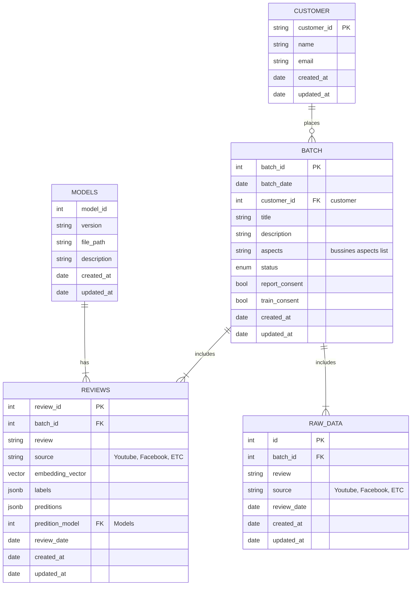

```mermaid
erDiagram
    CUSTOMER ||--o{ BATCH : places
    BATCH ||--|{ REVIEWS : includes
    MODELS ||--|{ REVIEWS : has
    BATCH ||--|{ RAW_DATA : includes

    CUSTOMER {
        string customer_id PK
        string name
        string email
        date created_at
        date updated_at
    }
    BATCH {
        int batch_id PK
        date batch_date
        int customer_id FK "customer"
        string title
        string description
        string aspects "bussines aspects list"
        enum status
        bool report_consent
        bool train_consent
        date created_at
        date updated_at
    }
    REVIEWS {
        int review_id PK
        int batch_id FK
        string review
        string source "Youtube, Facebook, ETC"
        vector embedding_vector
        jsonb labels
        jsonb preditions
        int predition_model FK "Models"
        date review_date
        date created_at
        date updated_at
    }
    MODELS {
        int model_id
        string version
        string file_path
        string description
        date created_at
        date updated_at
    }
    RAW_DATA {
        int id PK
        int batch_id FK
        string review
        string source "Youtube, Facebook, ETC"
        date review_date
        date created_at
        date updated_at
    }

```