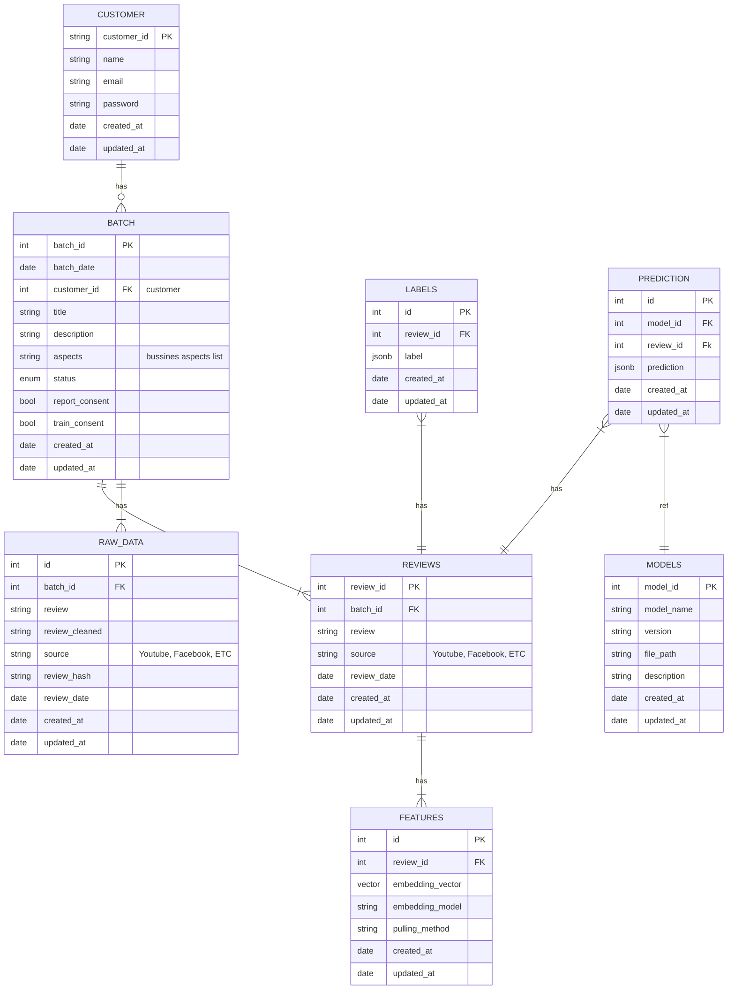

```mermaid
erDiagram
    CUSTOMER {
        string customer_id PK
        string name
        string email
        string password
        date created_at
        date updated_at
    }
    CUSTOMER ||--o{ BATCH : has
    
    BATCH {
        int batch_id PK
        date batch_date
        int customer_id FK "customer"
        string title
        string description
        string aspects "bussines aspects list"
        enum status
        bool report_consent
        bool train_consent
        date created_at
        date updated_at
    }
    BATCH ||--|{ REVIEWS : has
    BATCH ||--|{ RAW_DATA : has

    REVIEWS {
        int review_id PK
        int batch_id FK
        string review
        string source "Youtube, Facebook, ETC"
        date review_date
        date created_at
        date updated_at
    }
    REVIEWS ||--|{ FEATURES : has

    MODELS {
        int model_id PK
        string model_name
        string version
        string file_path
        string description
        date created_at
        date updated_at
    }

    RAW_DATA {
        int id PK
        int batch_id FK
        string review
        string review_cleaned
        string source "Youtube, Facebook, ETC"
        string review_hash
        date review_date
        date created_at
        date updated_at
    }

    FEATURES {
        int id PK
        int review_id FK
        vector embedding_vector
        string embedding_model
        string pulling_method
        date created_at
        date updated_at
    }

    LABELS {
        int id PK
        int review_id FK
        jsonb label
        date created_at
        date updated_at
    }
    LABELS }|--|| REVIEWS : has

    PREDICTION {
        int id PK
        int model_id FK
        int review_id Fk
        jsonb prediction
        date created_at
        date updated_at
    }
    PREDICTION }|--|| REVIEWS : has
    PREDICTION }|--|| MODELS : ref

```