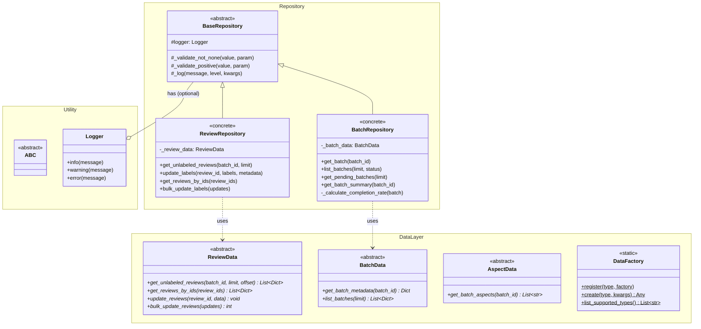

```mermaid
classDiagram

    direction TD
    namespace Utility {
        class ABC {
            <<abstract>>
        }
        class Logger {
            +info(message)
            +warning(message)
            +error(message)
        }
    }
    
    namespace DataLayer {

        class ReviewData{
            <<abstract>>
            +get_unlabeled_reviews(batch_id, limit, offset)* List~Dict~
            +get_reviews_by_ids(review_ids)* List~Dict~
            +update_reviews(review_id, data)* void
            +bulk_update_reviews(updates)* int
        }

        class BatchData{
            <<abstract>>
            +get_batch_metadata(batch_id)* Dict
            +list_batches(limit)* List~Dict~
        }

        class AspectData{
            <<abstract>>
            +get_batch_aspects(batch_id)* List~str~
        }

        class DataFactory {
            <<static>>
            +register(type, factory)$
            +create(type, kwargs)$ Any
            +list_supported_types()$ List~str~
        }
    }

    namespace Repository{
        class BaseRepository {
            <<abstract>>
            #logger: Logger
            #_validate_not_none(value, param)
            #_validate_positive(value, param)
            #_log(message, level, kwargs)
        }

        class ReviewRepository {
            <<concrete>>
            -_review_data: ReviewData
            +get_unlabeled_reviews(batch_id, limit)
            +update_labels(review_id, labels, metadata)
            +get_reviews_by_ids(review_ids)
            +bulk_update_labels(updates)
        }

        class BatchRepository {
            <<concrete>>
            -_batch_data: BatchData
            +get_batch(batch_id)
            +list_batches(limit, status)
            +get_pending_batches(limit)
            +get_batch_summary(batch_id)
            -_calculate_completion_rate(batch)
        }
    }

    BaseRepository --o Logger : has (optional)
    BaseRepository <|-- ReviewRepository
    ReviewRepository ..> ReviewData : uses
    BaseRepository <|-- BatchRepository
    BatchRepository ..> BatchData : uses

```